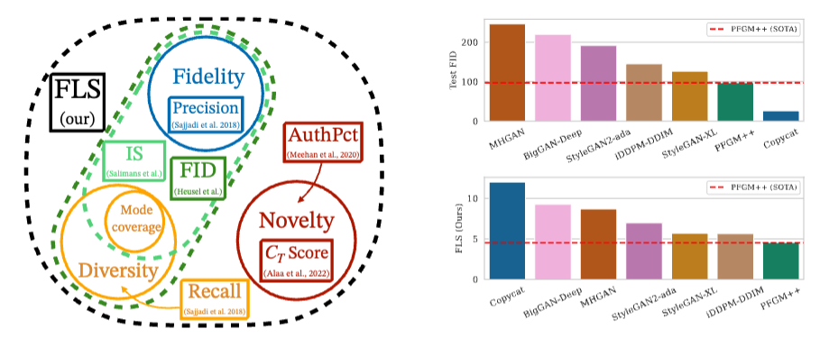

# Feature Likelihood Score: Evaluating the Generalization of Generative Models Using Samples
Marco Jiralerspong, Joey Bose, Ian Gemp, Chongli Qin, Yoram Bachrach, Gauthier Gidel

[[Paper](https://arxiv.org/pdf/2302.04440.pdf.)] [[Poster](TODO)]

PyTorch implementation of FLS and other metrics ([FID](https://github.com/mseitzer/pytorch-fid), [KID](https://arxiv.org/abs/1801.01401), [Precision](https://proceedings.neurips.cc/paper/2019/hash/0234c510bc6d908b28c70ff313743079-Abstract.html), [Recall](https://proceedings.neurips.cc/paper/2019/hash/0234c510bc6d908b28c70ff313743079-Abstract.html), etc.) with support for [DINOv2](https://github.com/facebookresearch/dinov2), [Inception-v3](https://arxiv.org/abs/1512.00567) and [CLIP](https://github.com/openai/CLIP) feature spaces. Allows for computation of metrics **from within your Python code** (e.g. directly from the generative model)



<center><i><b>Left:</b> Trichotomic evaluation of generative models. FLS evaluates all 3 axes concurrently. <b>Right:</b> Copycat, a generative model that only outputs copies of the training set, significantly beats out SOTA models when evaluated using Test FID.</i></center>
<p></p>

FLS is a comprehensive, sample-based metric that is sensitive to sample fidelity, diversity **and novelty** (i.e. whether a model is memorizing the training set). Relies on density estimation in a feature space to compute the perceptual likelihood of generated samples.
- Lower is better
- Roughly between [0, 100] where 0 corresponds to a perfect model


Currently, mainly built for images but all of the metrics can be extended to other modalities (audio, video, tabular, etc.) given appropriate feature extractors.


## Setup
```bash
pip install git+https://github.com/marcojira/fls.git
```

## Quick start
```python
from torchvision.datasets.cifar import CIFAR10
from fls.features.DINOv2FeatureExtractor import DINOv2FeatureExtractor
from fls.metrics.FLS import FLS

feature_extractor = DINOv2FeatureExtractor()

train_feat = feature_extractor.get_features(CIFAR10(train=True, root="data", download=True))
test_feat = feature_extractor.get_features(CIFAR10(train=False, root="data", download=True))


# From a directory of generated images
gen_feat = feature_extractor.get_dir_features("/path/to/images", extension="png")

fls_val = FLS().compute_metric(train_feat, test_feat, gen_feat)
print(f"FLS: {fls_val:.3f}")

# For other metrics
from fls.metrics.FID import FID
fid_val = FID().compute_metric(train_feat, None, gen_feat)
print(f"FID: {fid_val:.3f}")
```

**Note: While FLS is originally designed to evaluate sample novelty through the use of a test set, it can also be used without a test set. To do so, simply pass a small proportion of the train set to the metric instead of the training features. Note that doing so will yield a metric that is less sensitive to overfitting (as training samples that are memorized will get a high likelihood).**


## Standard Evaluation
**IMPORTANT:** For a comparable evaluation of FLS on CIFAR10, FFHQ and ImageNet, use the following settings:
- 10k generated samples
- DINOv2 feature space
- CIFAR10:
    - Train: Entire set (50k images)
    - Test: Entire set (10k images)
- FFHQ:
    - Train: First 60k images (of 70k)
    - Test: Last 10k images (i.e. the validation set described in https://github.com/NVlabs/ffhq-dataset)
- ImageNet (using the following [ImageNet subset](https://drive.google.com/file/d/1kbAvWrXw_GCE4ulMlx5zlfVOG_v6iMM7/view?usp=drive_link)):
    - Train: Entire train set (from the above)
    - Test: Entire test set (from the above)


## Advanced usage
The evaluation pipeline goes Data => Features => Metrics.
### Data
To get the train, test or gen features, data can be provided to the feature extractors in the following formats
```python
from fls.features.DINOv2FeatureExtractor import DINOv2FeatureExtractor

feature_extractor = DINOv2FeatureExtractor()

# torch.utils.Dataset (e.g. torchvision.datasets but could also be your own custom class)
from torchvision.datasets.cifar import CIFAR10
feat = feature_extractor.get_features(CIFAR10(train=True, root="data", download=True))

# Directory of samples (will create a dataset from all images in that directory that match `extension`, found recursively)
feat = feature_extractor.get_dir_features("/path/to/images", extension="jpg")

# Image tensor of float32 of size N x C x H x W in range [0, 1]
img_tensor = torch.rand((10000, 3, 32, 32))
feat = feature_extractor.get_tensor_features(img_tensor)
```

### Feature extraction
The `FeatureExtractor` class is designed to map images to the given feature space where metrics are computed.

#### Changing feature extractor
Currently supports DINOv2, CLIP and Inception-v3 (DINOv2 is recommended)
```python
from fls.features.DINOv2FeatureExtractor import DINOv2FeatureExtractor
from fls.features.CLIPFeatureExtractor import CLIPFeatureExtractor
from fls.features.InceptionFeatureExtractor import InceptionFeatureExtractor

feature_extractor = CLIPFeatureExtractor() # or InceptionFeatureExtractor()
```

#### Feature caching
Feature extraction can be relatively computationally expensive. By caching features, you can save yourselves from recomputing features unnecessarily. For example, if you want to evaluate model performance over the course of training, the train/test set features should only be computed once at the start of training and can then be retrieved from the cache for subsequent evaluations. To do so:

```python
# First specify where the features should be cached when creating the feature extractor
feature_extractor = DINOv2FeatureExtractor(save_path="/path/to/save/features")

# Then, pass `name` when getting features you want to cache
train_feat = feature_extractor.get_features(CIFAR10(train=True, root="data", download=True), name="CIFAR10_train") # Will cache
test_feat = feature_extractor.get_features(CIFAR10(train=False, root="data", download=True)) # Won't cache

gen_feat = feature_extractor.get_dir_features("/path/to/images", extension="png", name="CIFAR10_gen_epoch_0") # Will cache

# Finally, if you get features with the same `name` after that at any point, will retrieve from cache
train_feat = feature_extractor.get_features(CIFAR10(train=True, root="data", download=True), name="CIFAR10_train")
```

#### Adding a feature extractor
The `FeatureExtractor` class can be extended to use your own feature extractors (see example below, need to change everything where there's a `SPECIFY`).
```python
import torch
import torchvision.transforms as transforms
from fls.features.ImageFeatureExtractor import ImageFeatureExtractor

class CustomFeatureExtractor(ImageFeatureExtractor):
    def __init__(self, save_path=None):
        self.name = f"Custom" # SPECIFY
        super().__init__(save_path)

        self.features_size = 768 # SPECIFY

        # SPECIFY (function applied to inputs)
        self.preprocess = lambda x: x

    # SPECIFY (function that takes batch of preprocessed inputs and returns tensor of features)
    def get_feature_batch(self, img_batch):
        pass

# Can then use the same caching functionality of other extractors
feature_extractor = CustomFeatureExtractor(save_path="path/to/features")
gen_feat = feature_extractor.get_dir_features("/path/to/images", extension="png", name="CIFAR10_gen_epoch_0")```
```
### Metrics
Currently supported:
- FLS
- [AuthPct](https://proceedings.mlr.press/v162/alaa22a/alaa22a.pdf) (the % of authentic samples as defined by Authenticity)
- [CTTest](https://github.com/casey-meehan/data-copying) (the $C_T$ test statistic)
- [FID](https://github.com/mseitzer/pytorch-fid)
- [KID](https://arxiv.org/abs/1801.01401)
- [Precision](https://arxiv.org/abs/1904.06991)
- [Recall](https://arxiv.org/abs/1904.06991)

To compute other metrics:
```python
# All metrics have the function `.compute_metric(train_feat, test_feat, gen_feat)`

""" AuthPct """
from fls.metrics.AuthPct import AuthPct
AuthPct().compute_metric(train_feat, test_feat, gen_feat)

""" CTTest """
from fls.metrics.CTTest import CTTest
CTTest().compute_metric(train_feat, test_feat, gen_feat)

""" FID """
from fls.metrics.FID import FID
# Default FID (50k samples compared to train set)
FID().compute_metric(train_feat, None, gen_feat)
# Test FID
FID(ref_feat="test").compute_metric(None, test_feat, gen_feat)

""" FLS """
from fls.metrics.FLS import FLS
# To get Train FLS instead of Test FLS
FLS(eval_feat="train").compute_metric(train_feat, test_feat, gen_feat)

""" KID """
from fls.metrics.KID import KID
# Like FID, can get either Train or Test KID
KID(ref_feat="test").compute_metric(None, test_feat, gen_feat)

""" Precision/Recall """
from fls.metrics.PrecisionRecall import PrecisionRecall
PrecisionRecall(mode="Precision").compute_metric(train_feat, None, gen_feat) # Default precision
PrecisionRecall(mode="Recall", num_neighbors=5).compute_metric(train_feat, None, gen_feat) # Recall with k=5
```


## Evaluating overfitting
To only the degree of overfitting, we recommend looking at the **FLS generalization gap** (i.e. the difference between train and test FLS). The more this value is negative, the more your model is overfitting. This can be done as follows:
```python
from fls.metrics.FLS import FLS
train_fls = FLS(eval_feat="train").compute_metric(train_feat, test_feat, gen_feat)
test_fls = FLS(eval_feat="test").compute_metric(train_feat, test_feat, gen_feat)
gen_gap = train_fls - test_fls
print(f"Generalization Gap FLS: {gen_gap:.3f}")
```
## Additional uses

### Detecting memorized samples
For each generated sample $\{1...j \}$, we denote by $O_j$ the maximum likelihood assigned to a train set sample by the fit gaussian associated to it. $O_j$ acts as a memorization score,  higher it is, the more likely that $x_j$ is memorized.

```python
from fls.sample_evaluation import sample_memorization_scores
memorization_scores = sample_memorization_scores(train_feat, test_feat, gen_feat)
```

**Note: Potential of running into memory issues when passing too many generated samples **

### Evaluating individual sample quality
Instead of estimating the density of the generated samples, we can estimate the density of the *test set* and use it to get the likelihood of the
```python
from fls.sample_evaluation import sample_quality_scores
quality_scores = sample_quality_scores(train_feat, test_feat, gen_feat)
```
**Note: This is somewhat dependent on the feature space (e.g. some image classes are naturally closer in some feature spaces -> higher likelihood)**


## Citing
If you find this repository useful, please consider citing it:
```
@misc{jiralerspong2023feature,
      title={Feature Likelihood Score: Evaluating Generalization of Generative Models Using Samples},
      author={Marco Jiralerspong and Avishek Joey Bose and Ian Gemp and Chongli Qin and Yoram Bachrach and Gauthier Gidel},
      year={2023},
      eprint={2302.04440},
      archivePrefix={arXiv},
      primaryClass={cs.LG}
}
```

## Acknowledgements
The authors acknowledge the material support of NVIDIA in the form of computational resources.
Joey Bose was generously supported by an IVADO Ph.D. fellowship.
